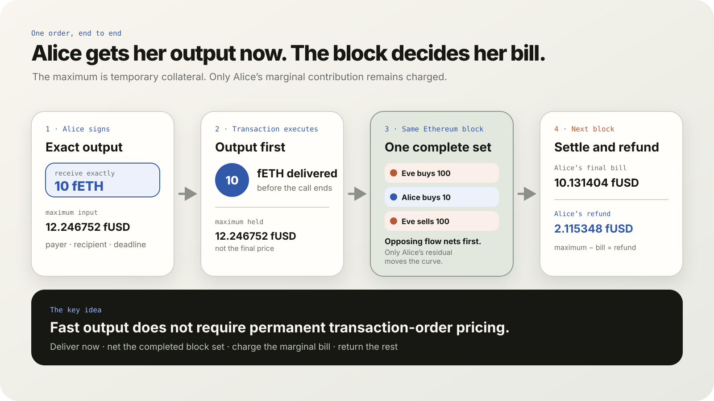
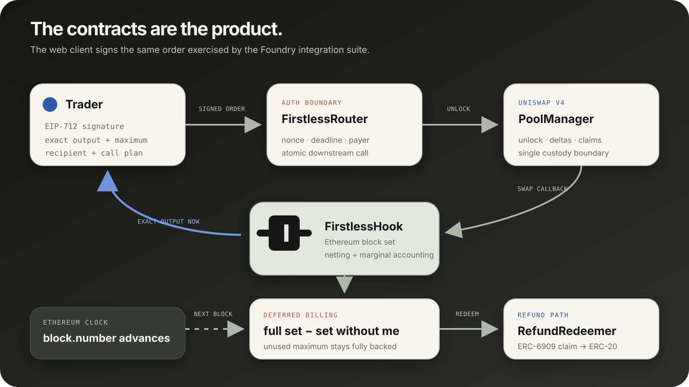
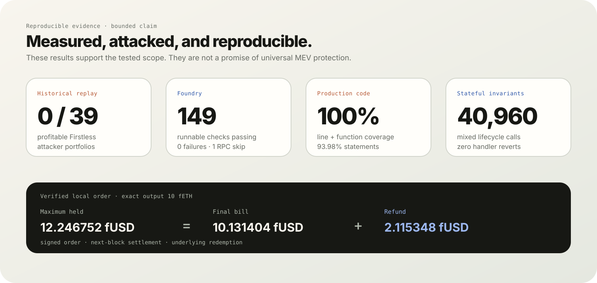

<p align="center">
  <picture>
    <source media="(prefers-color-scheme: dark)" srcset="assets/readme/firstless-mark-on-dark.svg" />
    <source media="(prefers-color-scheme: light)" srcset="apps/web/public/brand/firstless-mark.svg" />
    
  </picture>
</p>

<h1 align="center">firstless</h1>

<p align="center">
  <strong>Receive the tokens now. Let the whole block decide the bill.</strong><br />
  Firstless is a Uniswap v4 hook for exact-output orders. It holds a trader's signed maximum, delivers the requested output in the same transaction, then prices the order against the completed same-block set. Opposing flow nets first; the unused maximum comes back as a refund.
</p>

<p align="center">
  
  
  
  
</p>

```text
Live Sepolia order

Alice signs a 12.246752 fUSD maximum  →  receives exactly 10 fETH immediately
The block closes                       →  10.131404 fUSD final bill + 2.115348 fUSD refund
```

<p align="center">
  
</p>

## Why it exists

A normal AMM prices swaps one after another, so transaction position can permanently change what everyone pays. Firstless separates **when output is delivered** from **when the final input bill is calculated**:

1. A trader signs an exact-output order and a maximum input.
2. The hook collects the conservative maximum and sends the requested output immediately.
3. Every opted-in order observed in the same Ethereum block joins one clearing set.
4. Opposing flow nets at the opening reserve ratio; only the residual moves the curve.
5. Each trader pays the cost their order adds to the completed set. The unused maximum returns as a backed refund.

```text
final bill(i) = cost(complete set) − cost(set without i) + rounding buffer
refund(i)     = escrow(i) − final bill(i)
```

There is no attacker classifier and no privileged ordering rule. The same deterministic calculation applies to every order.

| What traders get                           | What the protocol proves                                                       |
| ------------------------------------------ | ------------------------------------------------------------------------------ |
| Exact output during the signed transaction | Output is usable by another contract before settlement                         |
| A signed maximum, never a surprise debit   | Payer, pool, recipient, call plan, nonce and block window are bound by EIP-712 |
| A final marginal bill after the set closes | Complete-set cost is compared with the same set minus one order                |
| A redeemable unused-input refund           | PoolManager claims back every refund liability                                 |
| An honest scope boundary                   | Same-pool, same-set, exact-output protection—not universal MEV prevention      |

## The mechanism, visually

<p align="center">
  
</p>

The full sandwich-shaped set matters. Eve's buy, Alice's buy, and Eve's reversing sell are considered together. Eve's opposing legs meet inside the set, while Alice's residual is the part that reaches the curve.

```text
Eve buys 100 ─┐
Alice buys 10 ├─ one Ethereum-block set ─ net opposing flow ─ residual hits curve
Eve sells 100 ┘

Alice's bill = cost(all three orders) − cost(the same set without Alice)
```

The maximum input is short-lived collateral—not the final price. Output can already be used while the final bill waits for the next Ethereum block.

## Proof, not vibes

<p align="center">
  
</p>

The current reproducible evidence includes:

- **149 passed, 0 failed, 1 RPC-only skip** across the no-RPC Foundry run;
- **105 adversarial checks** across accounting, economics, signatures, callbacks and lifecycle edges;
- **40,960 stateful invariant calls** with zero handler reverts;
- **1,000 fuzz cases per property**;
- **100% production line and function coverage**, 93.98% statements and 60.23% branches;
- **39 pinned Ethereum sandwich replays**: 37 profitable vanilla attacker portfolios and 0 profitable Firstless attacker portfolios; and
- real local and public Sepolia transaction lifecycles covering signed execution, immediate output, settlement, refund redemption, pending LP activation and LP withdrawal.

These measurements support the bounded tested claim. They do not prove the absence of every bug or every form of MEV.

## Why Uniswap v4 is load-bearing

Firstless is not an AMM with a decorative callback. It uses v4's core primitives as the execution and custody model:

| v4 primitive          | Firstless use                                                                             |
| --------------------- | ----------------------------------------------------------------------------------------- |
| Hook permissions      | Intercept initialization, swaps and liquidity modification                                |
| Custom accounting     | Run hook-owned liquidity and return swap deltas                                           |
| `PoolManager.unlock`  | Atomically settle payer input and immediate recipient output                              |
| ERC-6909 claims       | Keep reserves, escrow, pending deposits and refunds inside one accounted custody boundary |
| Dynamic-fee pool flag | Keep the curve fee inside final marginal billing instead of charging twice                |

See the official [v4 hooks overview](https://developers.uniswap.org/docs/protocols/v4/concepts/hooks), [custom-accounting guide](https://developers.uniswap.org/docs/protocols/v4/guides/custom-accounting), and [security guidance](https://developers.uniswap.org/docs/protocols/v4/security).

## Architecture

The dependency direction stays deliberately boring:

```text
Foundry artifacts → generated Wagmi client → React application
```

Production Solidity never depends on the frontend or the private research environment.

### Contract responsibilities

| Contract                             | Responsibility                                                                          |
| ------------------------------------ | --------------------------------------------------------------------------------------- |
| `FirstlessHook`                      | Ethereum-block set boundary and deployable v4 hook permissions                          |
| `AuthenticatedMarginalClearingEpoch` | Immutable signed-router boundary and checked block window                               |
| `MarginalClearingEpoch`              | Opposing-flow netting and leave-one-out marginal bills                                  |
| `ClearingCreditEpoch`                | Reserves, escrow, LP shares, pending capital, fees and refund liabilities               |
| `FirstlessRouter`                    | EIP-712 validation, payer settlement, output delivery and atomic downstream composition |
| `FirstlessRefundRedeemer`            | PoolManager claim redemption into the underlying ERC-20                                 |

## Run the real local product

### Prerequisites

- Node.js 22+
- npm 10+
- [Foundry](https://book.getfoundry.sh/getting-started/installation)

### One-command demo

```bash
git submodule update --init --recursive
npm ci
npm run demo
```

Open [http://127.0.0.1:5173](http://127.0.0.1:5173). The command starts Anvil, deploys a fresh PoolManager, tokens, router, redeemer and flag-valid hook, initializes and seeds the pool, generates the deployment manifest, and launches the web app.

The local connector uses Anvil's public test account. Never fund that key on a public chain.

### Verify the lifecycle independently

In another terminal:

```bash
npm run demo:verify
```

This uses an isolated port and proves:

```text
signed order
  → exact output delivered
  → Ethereum block advances
  → set settles
  → backed claim created
  → underlying refund redeemed
  → pending LP deposit activates
  → active LP shares withdraw
```

## Development commands

| Command                       | Purpose                                                                   |
| ----------------------------- | ------------------------------------------------------------------------- |
| `npm run demo`                | Launch a fresh local chain and the product site                           |
| `npm run demo:verify`         | Execute the isolated real-transaction lifecycle                           |
| `npm run contracts:dev`       | Start Anvil and deploy the complete local Firstless stack                 |
| `npm run contracts:stop`      | Stop only the recorded Firstless Anvil process                            |
| `npm run dev`                 | Generate contract interfaces and start Vite                               |
| `npm run check`               | Check Solidity formatting/build plus web types and production build       |
| `npm test`                    | Run unit, integration, security, fuzz, invariant and optional fork suites |
| `npm run test:coverage`       | Produce the accurate production-only coverage summary                     |
| `npm audit --audit-level=low` | Audit JavaScript dependencies                                             |

Focused suites:

```bash
npm run test:unit --workspace @firstless/contracts
npm run test:integration --workspace @firstless/contracts
npm run test:security --workspace @firstless/contracts
npm run test:invariant --workspace @firstless/contracts
npm run test:e2e --workspace @firstless/contracts
```

## Repository map

```text
firstless/
├── apps/
│   └── web/                    React/Vite story and live product dashboard
├── packages/
│   └── contracts/
│       ├── src/
│       │   ├── core/           Clearing, credit, liquidity and custody invariants
│       │   ├── hooks/          Deployable Ethereum Uniswap v4 hook
│       │   └── periphery/      Signed router and refund redeemer
│       ├── script/             Deployment, localnet and E2E workflows
│       ├── test/
│       │   ├── unit/           Mechanism and boundary behavior
│       │   ├── integration/    Real PoolManager and signed-router seams
│       │   ├── security/       Adversarial and economic matrices
│       │   ├── invariant/      Stateful lifecycle properties
│       │   └── fork/           Opt-in Ethereum Sepolia dependency check
│       └── lib/                Pinned Uniswap/OpenZeppelin submodule
├── assets/readme/              README diagrams and proof visuals
├── scripts/                    Repository-level workflows
├── turbo.json                  Task graph and cache boundaries
└── package.json                npm workspace command surface
```

## Ethereum Sepolia

The public demo is deployed on Ethereum Sepolia at block `11620547`. It uses the [official Uniswap v4 Sepolia PoolManager](https://developers.uniswap.org/docs/protocols/v4/deployments), a 0.3% curve fee (`997 / 1000`), a 10% per-side output cap, and 1,000 fETH / 1,000 fUSD of seeded test liquidity.

| Component | Address |
| --- | --- |
| Uniswap v4 PoolManager | [`0xE03A…3543`](https://sepolia.etherscan.io/address/0xE03A1074c86CFeDd5C142C4F04F1a1536e203543) |
| FirstlessHook | [`0xCb9D…EA88`](https://repo.sourcify.dev/11155111/0xCb9De08bf9cdD52275bD5BDAf68937EAdd23EA88) |
| FirstlessRouter | [`0xa5e0…ef09`](https://repo.sourcify.dev/11155111/0xa5e0305Fe94Cbb230B873227918953fd4e42ef09) |
| FirstlessRefundRedeemer | [`0x3179…F03F`](https://repo.sourcify.dev/11155111/0x317972d08e4aA4f2DC171886A0e48Dab75e9F03F) |
| fETH test token | [`0x1A88…a468`](https://repo.sourcify.dev/11155111/0x1A884b5Ac9e2229a11183748436489D1f8d3a468) |
| fUSD test token | [`0x9090…4868`](https://repo.sourcify.dev/11155111/0x9090cC6c504C748e6dd72F0a44B13235F7Cf4868) |

Pool ID: `0xa15f2e838229c1df30e53f685327b968a15955adfd271e14d15007271c46d322`

All five Firstless contracts are exact creation- and runtime-bytecode matches on Sourcify. The tracked runtime manifest is [`apps/web/public/deployments/sepolia.json`](apps/web/public/deployments/sepolia.json).

### Public lifecycle proof

The release wallet exercised the deployed contracts rather than only checking their bytecode:

| Step | Sepolia transaction |
| --- | --- |
| Hook deployment | [`0x2d62…fe20`](https://sepolia.etherscan.io/tx/0x2d62cc878b6bf272eb75b157cd31f144c5d8dd108f146f9ded8e95ff0263fe20) |
| Pool initialization and seed | [`initialize`](https://sepolia.etherscan.io/tx/0x16104b706159ec1e0910557bb746214c7024e1cfa94af1a481c43482e1008d5c) · [`seed`](https://sepolia.etherscan.io/tx/0xd1def40edf477a5641811032d940721f3874754306e63f74fe94b9cf07ebeeeb) |
| Signed exact-output order | [`0x1cb2…6fd3`](https://sepolia.etherscan.io/tx/0x1cb2ada56895f5f544c9cbe7f6c41fd677259c4ef91b6b9affdaf3fa2e446fd3) |
| Next-block settlement | [`0x29cf…faa3`](https://sepolia.etherscan.io/tx/0x29cf52003a4e793fc660dcee159537c2b54daf155f52473e6be9a8f8dfc2faa3) |
| Refund claim and redemption | [`claim`](https://sepolia.etherscan.io/tx/0x193a246d50b9e8a780c95ef25cacde9648b780ba04c37e4b725a045ba58174b9) · [`redeem`](https://sepolia.etherscan.io/tx/0x849bcabbc8984378f00dc551eb0e6a56ddaed4842799d98461128c13c7f63906) |
| Deferred LP activation | [`queue`](https://sepolia.etherscan.io/tx/0xa74d0aa3f094941ab0693153de83b4b22118e1878424b3509f1f6b8b151df3b1) · [`activate`](https://sepolia.etherscan.io/tx/0x30b86645f529b92cb509a65cdfe5c2e5bcd8f8c360fd6244a464ed4b25519124) |
| Active LP withdrawal | [`0xe6ec…016d`](https://sepolia.etherscan.io/tx/0xe6ec7fdf3baeeedf8d77b6082ca34012d24fdd5ffa1242a9d9e27fd88990016d) |

The public order delivered exactly 10 fETH from a 12.246752467414453392 fUSD maximum. Settlement fixed the final bill at 10.131404313951956890 fUSD and returned a fully backed 2.115348153462496502 fUSD refund. The LP check then activated 24.749255288205971736 shares one block after deposit and withdrew half.

Each test token exposes a one-time `faucet()` allotment of 1,000 tokens per address. They are intentionally valueless and the faucet is not shown as a production product action.

To run the web client against the public deployment instead of Anvil:

```bash
VITE_DEPLOYMENT_PATH=/deployments/sepolia.json npm run dev
```

Unichain Flashblocks are a possible future latency deployment, not a second demo path. The current mechanism and evidence use checked Ethereum `block.number` semantics.

## Security boundaries

> [!WARNING]
> Firstless is experimental, unaudited hackathon software. Its public Sepolia deployment uses valueless test tokens and is not production-ready.

| Supported now                                  | Explicitly outside the claim                                     |
| ---------------------------------------------- | ---------------------------------------------------------------- |
| Exact-output conventional ERC-20 pairs         | Native ETH, fee-on-transfer, rebasing or callback-bearing tokens |
| Orders through the immutable Firstless router  | Direct arbitrary PoolManager routing                             |
| One Firstless pool and Ethereum-block set      | Cross-pool and cross-block strategies                            |
| Backed short-lived credit and refunds          | Censorship resistance or builder guarantees                      |
| Tested sandwich and harm-allocation properties | Universal MEV prevention or external-price LVR protection        |
| Pending-to-active LP lifecycle                 | Independent audit or production-readiness certification          |

Read [.github/SECURITY.md](.github/SECURITY.md) before changing accounting, authentication, hook permissions or liquidity behavior.

<details>
<summary><strong>Troubleshooting the local demo</strong></summary>

### Port 8546 is already in use

The launcher refuses to kill an unknown process. Stop it yourself or choose another Firstless RPC port:

```bash
FIRSTLESS_RPC_PORT=9546 npm run contracts:dev
```

### The dashboard says the deployment is missing

Start the chain before Vite so `apps/web/public/deployments/local.json` exists:

```bash
npm run contracts:dev
npm run dev
```

### Wallet providers collide

Use the built-in **Local demo wallet** connector or a clean browser profile with one injected wallet. Multiple extensions may race to define `window.ethereum`.

### Contract interfaces look stale

Regenerate them from Foundry artifacts; do not hand-edit the generated ABI:

```bash
npm run generate:contracts --workspace @firstless/web
```

</details>

## License

[MIT](LICENSE)
